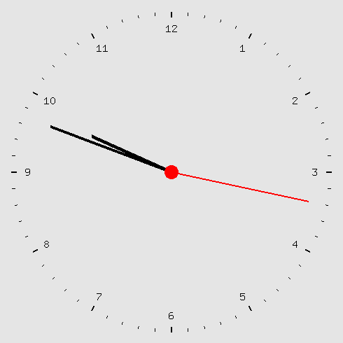

# Graphic-Clock
Lightweight graphic wall-clock using OpenGL and FreeGLUT.

### Linux FreeGLUT install
`sudo apt-get install freeglut3-dev`

### Windows FreeGLUT install
Download the respective prepackaged [Windows binary](https://www.transmissionzero.co.uk/software/freeglut-devel/) either for the MSVC or MinGW compilers, then place the x86 library files at the root of the project. For use with Visual C++, you can link the third-party lib and include folders in the project properties to circumvent placing each of the FreeGLUT files in the project folder.

---

